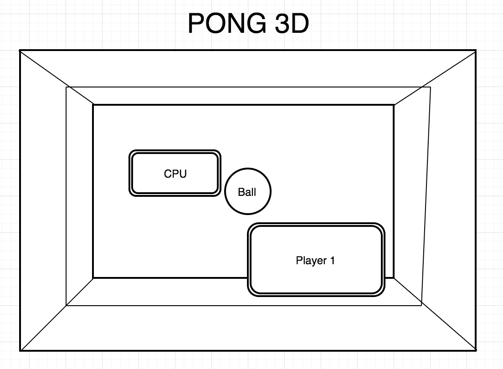

# Pong 3D Proposal

## Background
Pong 3D is a JavaScript clone of Curveball and a 3D version of the game Pong. It features a 3D field and allows players to interact with a ball and opponent paddle in order to score a goal.

## Functionality and MVP
- [ ] Start/Pause Game
- [ ] Human Player paddle
- [ ] Computer AI
- [ ] 3 lives
- [ ] 5 rounds

## Wireframes

## Implementation Timeline
1. Render ball, paddle, and field
2. Scale ball size/distance, speed/curving
3. Create AI for CPU paddle

## Bonus
- [ ] Sounds
